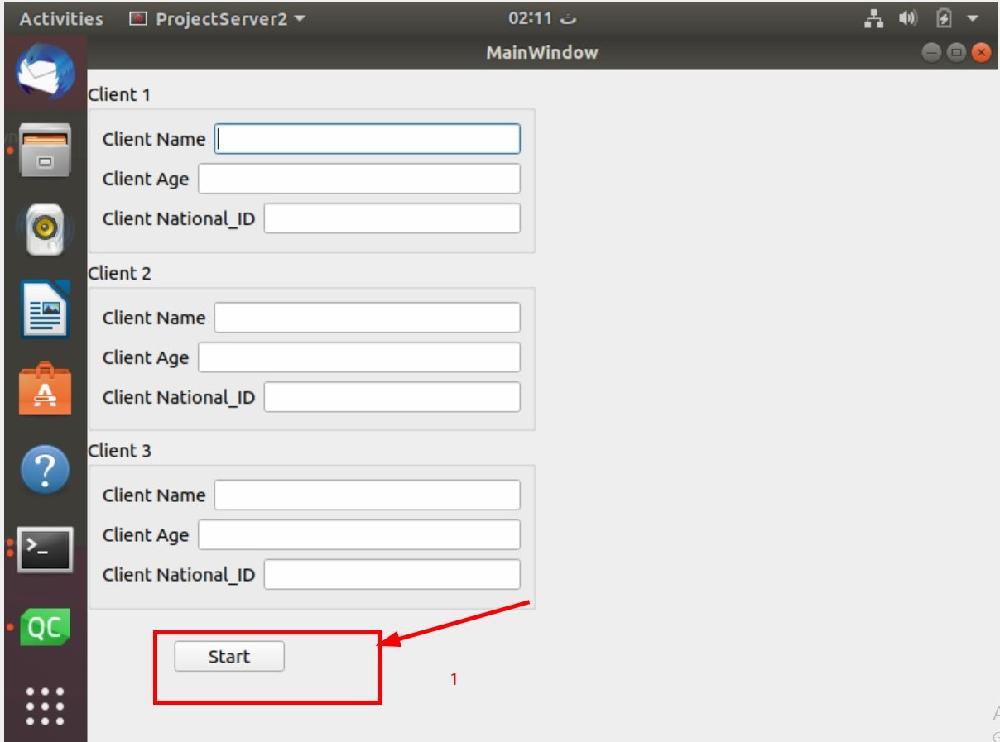
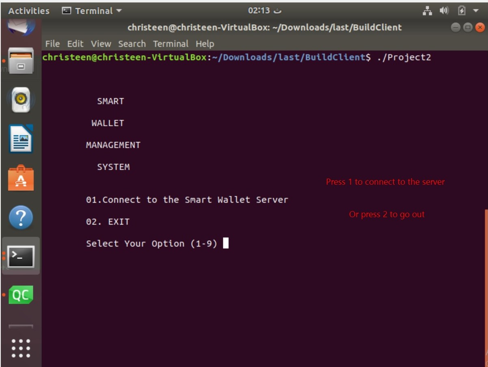
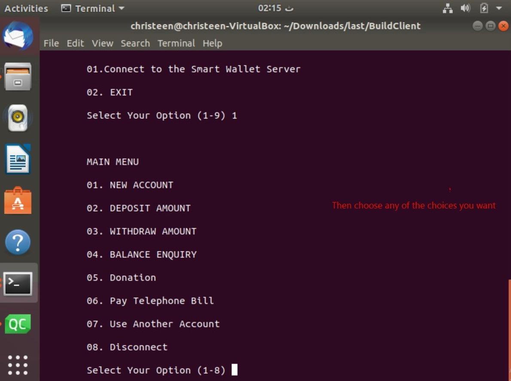
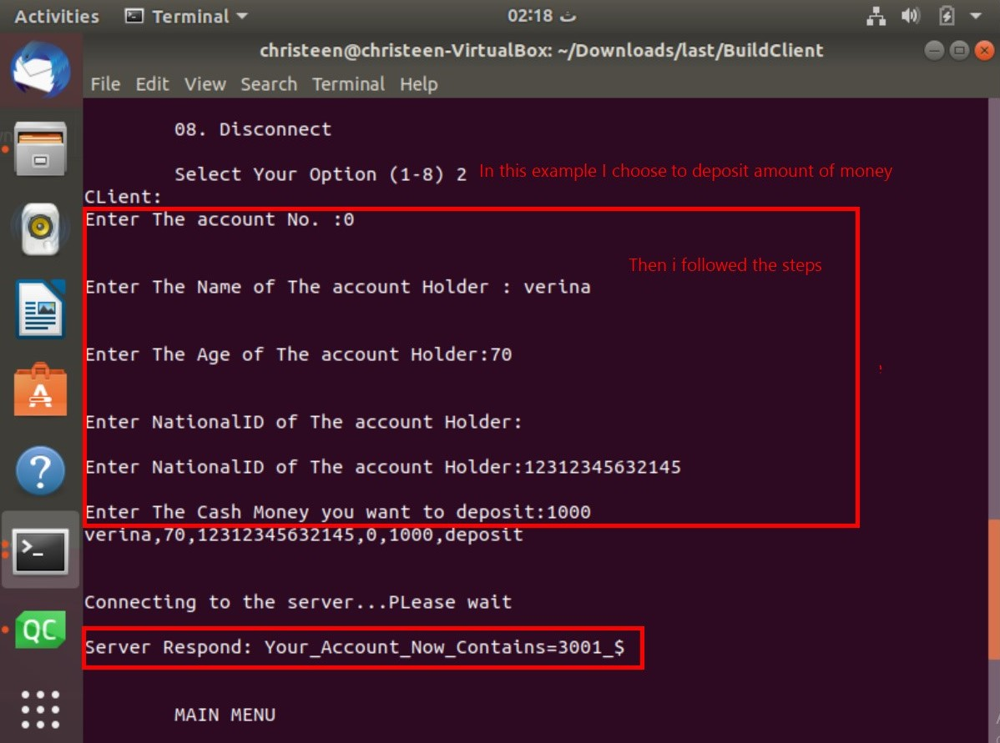

# 📌 Project Overview
#### This project is a smart wallet system that allows clients to manage their accounts through a server-client architecture. 
#### Clients can perform various transactions, and the server maintains records for each account.

## 🖥️ Server Data Management
#### The server handles client data by creating and managing the following files:

### 1️⃣ Files Created by the Server:
#### 📂 accountfile.dat → A file storing all accounts details.
#### 📂 allaccount.txt → A text file containing account data, readable by server owners.
#### 📂 Transaction Files → Each client has a unique text file storing their transaction history. File Naming Convention: (Last two digits of National ID) + "_" + (Account Number)

### 2️⃣ Account Number Management:
#### Account numbers are generated sequentially.
#### Used account numbers are stored in a map to prevent duplication.

### 3️⃣ Auto-Generated Accounts:
#### If a user requests their balance and no account is found, a new account with zero balance is automatically created.

### 4️⃣ Supported Transactions:

#### ✅ Deposit money
#### ✅ Withdraw money
#### ✅ Pay telephone bills
#### ✅ Donate to charities
#### ✅ Check account balance

## 📁 Project Folder Structure
#### 1️⃣ BuildClient → Contains the precompiled client build (Static Linking), allowing it to run on any PC without requiring additional libraries.
#### 2️⃣ client/Project2/Project2 → C++ source code for the client application.
#### 3️⃣ BuildOneuser → Contains the precompiled server build (Static Linking) for a version of the server that handles one client at a time.
#### 4️⃣ oneuser/ProjectServer2/ProjectServer2 → C++ source code for the single-user server.
#### 5️⃣ Buildmulti → Contains the precompiled server build (Static Linking) for a version of the server that can handle up to 3 clients simultaneously.
#### 6️⃣ multi/ProjectServer2multi/ProjectServer2 → C++ source code for the multi-client server.

## 🖥️ How to Use the UI

### 1️⃣ Start the Server
Open the server UI and press "Start" to begin listening for client connections.
(In the multi-client version, up to 3 clients can connect simultaneously).

### 2️⃣ Run the Client
Launch the client application.

### 3️⃣ Connect to the Server
Press "1" to establish a connection.

### 4️⃣ Choose a Transaction
Select the type of transaction to perform.

### 5️⃣ Complete the Transaction
Follow the prompts to complete the transaction.
Example: To deposit money, enter the following details:

👤 Account Owner Name
📅 Account Owner's Age
🆔 National ID
💰 Deposit Amount

